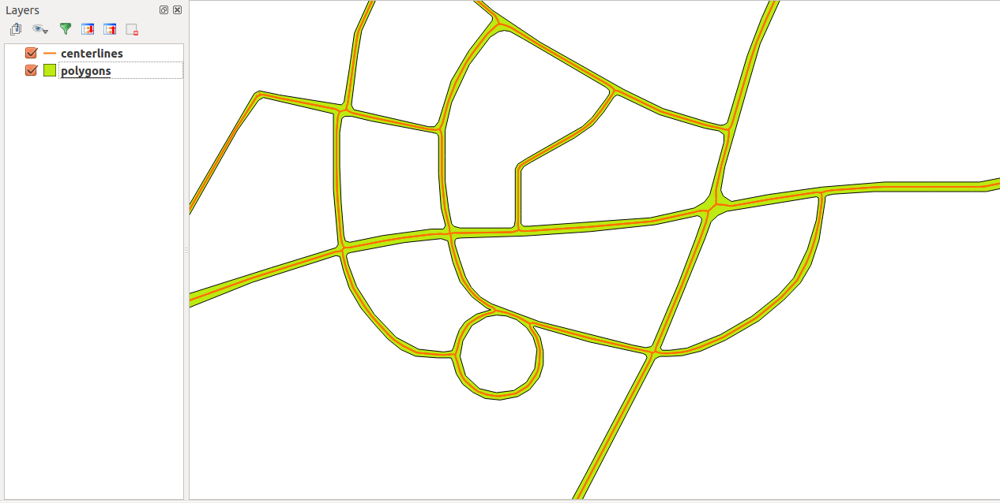

# Centerline

## Calculate the centerline of a polygon.

Roads, rivers and similar linear structures are often represented by long and complex polygons. Since one of the most important attributes of a linear structure is its length, extracting that attribute from a polygon can prove to be more or less difficult.

### Installation:

You can download the package from PyPI:
```
$ pip install centerline
```
**Warning:**
This package has several dependencies, including Numpy, [Scipy](http://www.scipy.org/install.html) and [GDAL/OGR](https://pypi.python.org/pypi/GDAL/). If you are installing these packages in the virtual environement, make sure you have all the necessary dependencies on your system. Furthermore, after installing GDAL locate the GDAL headers:
```
$ whereis gdal
gdal: /usr/include/gdal /usr/share/gdal
```
and set the include path using the following environment variables:
```
$ export CPLUS_INCLUDE_PATH=/usr/include/gdal/
$ export C_INCLUDE_PATH=/usr/include/gdal/
```
After that, you can proceed to installing GDAL in the virtual environment.
For more info, visit [Stack Exchange](http://gis.stackexchange.com/questions/28966/python-gdal-package-missing-header-file-when-installing-via-pip).

### Usage:
If you are planning on using this package inside of your own code, just type:
```python
>>> from centerline import Centerline
```
However, if you just want to convert a Shapefile full of polygons into a Shapefile full of centerlines, use the command line tool:
```
$ shp2centerline INPUT_PATH.shp OUTPUT_PATH.shp [BORDER_DENSITY]
```
The BORDER_DENSITY parameter is optional. If not specified, the default value is 0.5.

**Warning:**
The INPUT_PATH.shp file needs to have a column called **id** with unique values or the script will fail to execute successfully.

### References:
* [SciPy-Voronoi](http://docs.scipy.org/doc/scipy/reference/tutorial/spatial.html#voronoi-diagrams)

**Notes**:
When defining the density factor, one has to take into account the coordinate system defined in the Shapefile. The script was designed to handle metric coordinate systems, so the density factor is by default 0.5 (meters). For instance, if the value is set to 0.5 m, it basically places additional points on the border at the distance of 0.5 m from each other. If the user doesn't define the value (see *Usage*), the script uses the default value. If the value is a negative number, it will be converted into a positive number.

It appears that the Voronoi function available in the *SciPy* module does not handle large coordinates very well. Since most of the coordinates are large numbers, a bounding box is needed to determine the minimal X and Y coordinates, i.e. the bottom left corner of the bounding box. These values are then used for coordinate reduction. Once the Voronoi diagram is created the coordinates are returned to their non-reduced form before creating LineStrings.

**Example**

